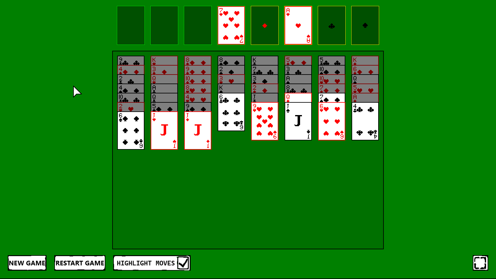

# Freecell (https://pavelverigo.github.io/freecell/)

```
zig build
```

```
python3 -m http.server
```

# Technical

- Sprites embed directly into wasm binary
- No WebGL, only software rendering, final image buffer is copied to &lt;canvas&gt;
- Zero dependecies, except stb_image for sprite compilation

# Assets

Cards refactored from: https://screamingbrainstudios.itch.io/poker-pack

Cursor: https://void1gaming.itch.io/free-basic-cursor-pack

Winning font: https://zingot.itch.io/fontpack

Winning audio: https://timbeek.itch.io/casual-soundfx-pack

Card audio: https://www.kenney.nl/assets/casino-audio

# Screenshot
